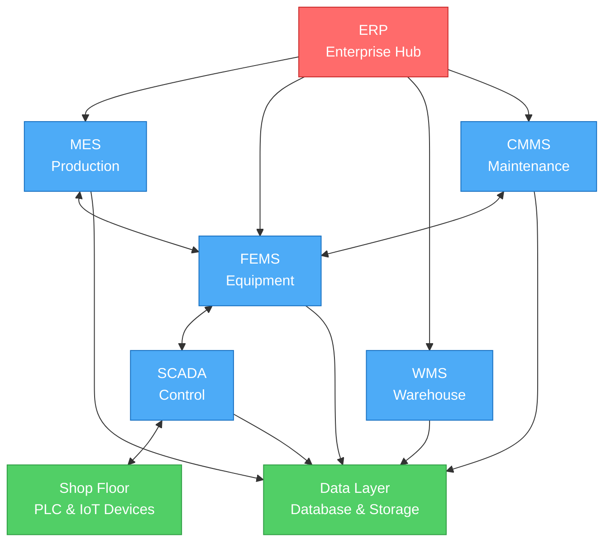

# Manufacturing Integration Platform (MIP)

**Transform Your Factory into a Smart, Connected Enterprise**

---

## Overview

MIP is an enterprise-grade platform that unifies your entire manufacturing ecosystem—from shop floor to top floor. Gain real-time visibility, predictive insights, and seamless control across all operations.

---

## System Architecture

---

## Integrated Modules

### 📊 Core Business Systems
- **ERP** - Enterprise resource planning with centralized authentication
- **MES** - Real-time production execution and work order management
- **SIMS** - Intelligent inventory tracking and optimization
- **WMS** - Warehouse operations and logistics management
- **CMMS** - Preventive maintenance and asset management

### ⚙️ Operations & Control
- **SCADA** - Real-time equipment monitoring and control
- **FEMS** - Equipment health monitoring and predictive maintenance
- **KIOSK** - Shop floor terminals for operator control
- **IoT Alert System** - Wireless emergency response buttons

### 🔗 Integration Layer
- **OPC-UA & PLC** - Industrial equipment connectivity
- **MQTT Broker** - IoT device communication
- **Batch Processing** - Automated reporting and data aggregation
- **Elasticsearch Stack** - Enterprise-wide search and log management

### 💾 Data Infrastructure
- **SQL Server 2022** - Enterprise relational database
- **MinIO Object Storage** - Scalable file and document storage
- **Real-time Analytics** - Live KPI dashboards and insights

---

## Technology Foundation

Built on proven, enterprise-grade technologies:

- **Backend**: Spring Boot, Java 17
- **Frontend**: Next.js, React, TypeScript
- **Database**: Microsoft SQL Server 2022
- **Storage**: MinIO (S3-compatible)
- **Search**: Elasticsearch
- **IoT**: MQTT, OPC-UA
- **Deployment**: Docker, Kubernetes, Cloud-ready

---

## Key Benefits

### 🚀 Operational Excellence
- Real-time visibility across all operations
- Predictive maintenance reducing downtime by up to 40%
- Automated quality tracking and compliance
- Optimized inventory levels and reduced waste

### 💡 Business Intelligence
- Instant search across all business data
- Role-based dashboards and KPIs
- Automated reporting and analytics
- Complete audit trail for compliance

### 🔒 Enterprise Security
- Single Sign-On (SSO) across all systems
- Role-based access control
- End-to-end data encryption
- Comprehensive activity logging

### ⚡ Scalability & Reliability
- Microservices architecture
- Cloud and on-premises deployment
- High availability (99.9%+ uptime)
- Proven performance at enterprise scale

---

## Deployment Flexibility

| **On-Premises** | **Cloud** | **Hybrid** |
|-----------------|-----------|------------|
| Full infrastructure control | Elastic scalability | Best of both worlds |
| Custom network setup | Global availability | Data sovereignty compliance |
| Direct hardware integration | Managed services | Optimized cost structure |

---

## Industry Solutions

We serve leading manufacturers across multiple industries:

✅ Automotive Manufacturing  
✅ Electronics & Semiconductors  
✅ Food & Beverage  
✅ Pharmaceuticals  
✅ Chemical Processing  
✅ Aerospace & Defense  
✅ Consumer Goods

---

## Why Choose MIP?

**Proven Results**
- 40% reduction in equipment downtime
- 30% improvement in production efficiency
- 25% reduction in inventory carrying costs
- 99.9% system uptime

**Future-Ready Platform**
- Industry 4.0 compliant
- AI/ML ready architecture
- Continuous innovation
- Long-term vendor support

**Easy Integration**
- Standard industrial protocols (OPC-UA, MQTT)
- RESTful APIs for custom integrations
- Pre-built connectors for major systems
- Comprehensive documentation

---

## Get Started

**Ready to modernize your manufacturing operations?**

📧 **Email**: info@mip-platform.com  
🌐 **Website**: www.mip-platform.com  
📞 **Phone**: +82-XX-XXXX-XXXX

Request a demo and discover how MIP can transform your factory.

---

© 2025 Manufacturing Integration Platform. All rights reserved.
